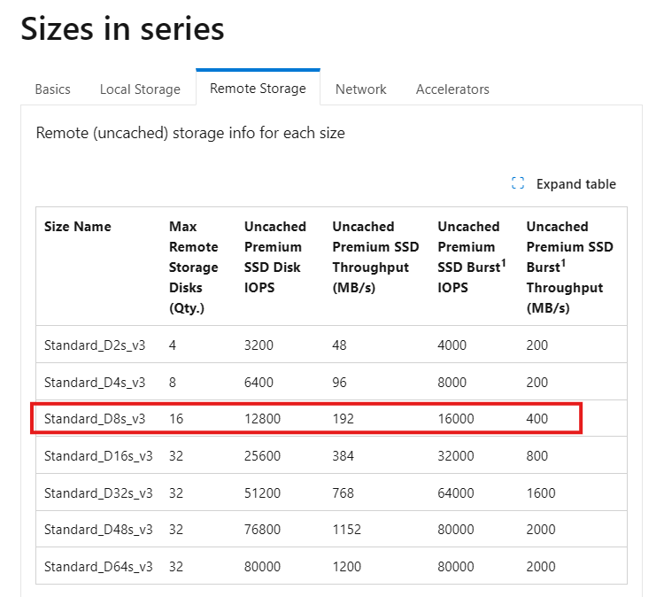

# Virtual machine and disk performance

**Applies to:** :heavy_check_mark: Linux VMs :heavy_check_mark: Windows VMs :heavy_check_mark: Flexible scale sets :heavy_check_mark: Uniform scale sets

This article helps clarify disk performance and how it works when you combine Azure Virtual Machines and Azure disks. It also describes how you can diagnose bottlenecks for your disk IO and the changes you can make to optimize for performance.

## How does disk performance work?
Azure virtual machines (VM) have input/output operations per second (IOPS) and throughput performance limits based on the VM type and size. OS disks and data disks can be attached to virtual machines. The disks have their own IOPS and throughput limits.

## Disk allocation and performance

There are three paths that bandwidth and I/O operations per second (IOPS) can take to disks attached to a VM in Azure. The following diagram depicts real-time allocation of these paths.

The following diagram depicts real-time allocation of bandwidth and I/O operations per second (IOPS) for disks, with three paths that I/O can take.

:::image type="content" source="media/disks-performance/real-time-disk-allocation.png" alt-text="Diagram of a three-level provisioning system that shows bandwidth and IOPS allocation." lightbox="media/disks-performance/real-time-disk-allocation.png":::

The first I/O path is the uncached managed disk path. I/O operations use this path when you're using a managed disk and you set the host caching to `none`. I/O operations that use this path run based on disk-level provisioning and then VM network-level provisioning for IOPS and throughput.

The second I/O path is the cached managed disk path. Cached managed disk I/O uses an SSD that's close to the VM. This SSD has its own IOPS and throughput provisioned, and it appears as "SSD-level provisioning" in the diagram.

When a cached managed disk initiates a read, the request first checks to see if the data is in the server SSD. If the data isn't present, a cached miss occurs. Then the I/O runs based on SSD-level provisioning, disk-level provisioning, and then VM network-level provisioning for IOPS and throughput.

When the server SSD initiates reads on cached I/O that are present on the server SSD, a cache hit occurs. The I/O then runs based on the SSD-level provisioning. Writes that a cached managed disk initiates always follow the path of a cached miss. They go through SSD-level, disk-level, and VM network-level provisioning.

The third path is for the *Local/Temp* disk. It's only available on VMs that support *[Local/Temp](managed-disks-overview.md#temporary-disk)* disks. An I/O operation that uses this path runs based on SSD-level provisioning for IOPS and throughput.

The following diagram depicts an example of these limitations. The system prevents a Standard_D2s_v3 VM from achieving the 5,000 IOPS potential of a P30 disk, whether it's cached or not, because of limits at the SSD and network levels.

:::image type="content" source="media/disks-performance/example-vm-allocation.png" alt-text="Diagram of the three-level provisioning system with a Standard_D2s_v3 example allocation." lightbox="media/disks-performance/example-vm-allocation.png":::

Azure uses a prioritized network channel for disk traffic. Disk traffic takes precedence over low-priority network traffic. This prioritization helps disks maintain their expected performance if there's network contention.

Similarly, Azure Storage handles resource contentions and other issues in the background with automatic load balancing. Azure Storage allocates required resources when you create a disk, and it applies proactive and reactive balancing of resources to handle the traffic level. This behavior further ensures that disks can sustain their expected IOPS and throughput targets. Use VM-level and disk-level [metrics](disks-metrics.md) to track the performance and set up alerts as needed.

## Disk IO capping

Your application's performance gets capped when it requests more IOPS or throughput than what is allotted for the virtual machines or attached disks. When capped, the application experiences suboptimal performance. This can lead to negative consequences like increased latency. Let's run through a couple of examples to clarify this concept. To make these examples easy to follow, we'll only look at IOPS. But, the same logic applies to throughput.

**Setup:**

- Standard_D8s_v3
  - Uncached IOPS: 12,800
- E30 OS disk
  - IOPS: 500
- Two E30 data disks × 2
  - IOPS: 500

The application running on the virtual machine makes a request that requires 10,000 IOPS to the virtual machine. All of which are allowed by the VM because the Standard_D8s_v3 virtual machine can execute up to 12,800 IOPS.

The 10,000 IOPS requests are broken down into three different requests to the different disks:

- 1,000 IOPS are requested to the operating system disk.
- 4,500 IOPS are requested to each data disk.

All attached disks are E30 disks and can only handle 500 IOPS. So, they respond back with 500 IOPS each. The application's performance is capped by the attached disks, and it can only process 1,500 IOPS. The application could work at peak performance at 10,000 IOPS if better-performing disks are used, such as Premium SSD P30 disks.

## Virtual machine IO capping

**Setup:**

- Standard_D8s_v3
  - Uncached IOPS: 12,800
- P30 OS disk
  - IOPS: 5,000
- Two P30 data disks × 2
  - IOPS: 5,000

The application running on the virtual machine makes a request that requires 15,000 IOPS. Unfortunately, the Standard_D8s_v3 virtual machine is only provisioned to handle 12,800 IOPS. The application is capped by the virtual machine limits and must allocate the allotted 12,800 IOPS.

Those 12,800 IOPS requested are broken down into three different requests to the different disks:

- 4,267 IOPS are requested to the operating system disk.
- 4,266 IOPS are requested to each data disk.

All attached disks are P30 disks that can handle 5,000 IOPS. So, they respond back with their requested amounts.

## Virtual machine uncached vs cached limits
Virtual machines that are enabled for both premium storage and premium storage caching have two different storage bandwidth limits. Let's look at the Standard_D8s_v3 virtual machine as an example. Here is the documentation on the [Dsv3-series](./sizes/general-purpose/dsv3-series.md) and the Standard_D8s_v3:

- The "*Uncached*" disk data under the **Remote Storage** are the default storage maximum limits that the virtual machine can handle.
    

- The "*Cached*" disk data under the **Local Storage** tab are separate limits when you enable host caching.
    

Host caching works by bringing storage closer to the VM that can be written or read to quickly. The amount of storage that is available to the VM for host caching is in the documentation. For example, you can see the Standard_D8s_v3 comes with 200 GiB of cache storage.

You can enable host caching when you create your virtual machine and attach disks. You can also turn on and off host caching on your disks on an existing VM. By default, cache-capable data disks do not have caching enabled. Cache-capable OS disks have read/write caching enabled.

You can adjust the host caching to match your workload requirements for each disk. You can set your host caching to be:

- **Read-only**: For workloads that only do read operations
- **Read/write**: For workloads that do a balance of read and write operations

If your workload doesn't follow either of these patterns, we don't recommend that you use host caching.

Let's run through a couple examples of different host cache settings to see how it affects the data flow and performance. In this first example, we see what happens with IO requests when the host caching setting is set to **Read-only**.

**Setup:**

- Standard_D8s_v3
  - Cached IOPS: 16,000
  - Uncached IOPS: 12,800
- P30 data disk
  - IOPS: 5,000
  - Host caching: **Read-only**

When a read is performed and the desired data is available on the cache, the cache returns the requested data. There's no need to read from the disk. This read is counted toward the VM's cached limits.

When a read is performed and the desired data *isn't* available on the cache, the read request is relayed to the disk. Then the disk surfaces it to both the cache and the VM. This read is counted toward both the VM's uncached limit and the VM's cached limit.

When a write is performed, the write has to be written to both the cache and the disk before it's considered complete. This write is counted toward the VM's uncached limit and the VM's cached limit.

Next let's look at what happens with IO requests when the host cache setting is set to **Read/write**.

**Setup:**

- Standard_D8s_v3
  - Cached IOPS: 16,000
  - Uncached IOPS: 12,800
- P30 data disk
  - IOPS: 5,000
  - Host caching: **Read/write**

A read is handled the same way as a read-only. Writes are the only thing that's different with read/write caching. When writing with host caching is set to **Read/write**, the write only needs to be written to the host cache to be considered complete. The write is then lazily written to the disk when the cache is flushed periodically. Customers can additionally force a flush by issuing an `f/sync` or `fua` command. This means that a write is counted toward cached IO when it's written to the cache. When it's lazily written to the disk, it counts toward the uncached IO.

Let’s continue with our Standard_D8s_v3 virtual machine. Except this time, we enable host caching on the disks. This makes the VM's IOPS limit 16,000 IOPS. Attached to the VM are three underlying P30 disks that can each handle 5,000 IOPS.

**Setup:**

- Standard_D8s_v3
  - Cached IOPS: 16,000
  - Uncached IOPS: 12,800
- P30 OS disk
  - IOPS: 5,000
  - Host caching: **Read/write**
- Two P30 data disks × 2
  - IOPS: 5,000
  - Host caching: **Read/write**

The application uses a Standard_D8s_v3 virtual machine with caching enabled. It makes a request for 16,000 IOPS. The requests are completed as soon as they're read or written to the cache. Writes are then lazily written to the attached Disks.

## Combined uncached and cached limits

A virtual machine's cached limits are separate from its uncached limits. This means you can enable host caching on disks attached to a VM while  not enabling host caching on other disks. This configuration allows your virtual machines to get a total storage IO of the cached limit plus the uncached limit.

Let's run through an example to help you understand how these limits work together. We continue with the Standard_D8s_v3 virtual machine and premium disks attached configuration.

**Setup:**

- Standard_D8s_v3
  - Cached IOPS: 16,000
  - Uncached IOPS: 12,800
- P30 OS disk
  - IOPS: 5,000
  - Host caching: **Read/write**
- Two P30 data disks × 2
  - IOPS: 5,000
  - Host caching: **Read/write**
- Two P30 data disks × 2
  - IOPS: 5,000
  - Host caching: **Disabled**

In this case, the application running on a Standard_D8s_v3 virtual machine makes a request for 25,000 IOPS. The request is broken down as 5,000 IOPS to each of the attached disks. Three disks use host caching and two disks don't use host caching.

- Since the three disks that use host caching are within the cached limits of 16,000, those requests are successfully completed. No storage performance capping occurs.
- Since the two disks that don't use host caching are within the uncached limits of 12,800, those requests are also successfully completed. No capping occurs.