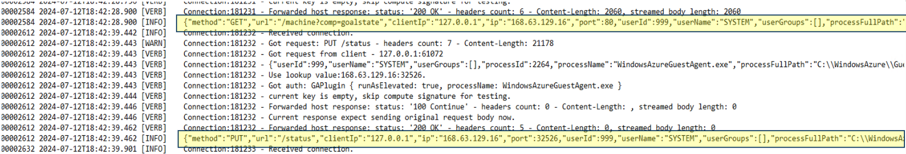
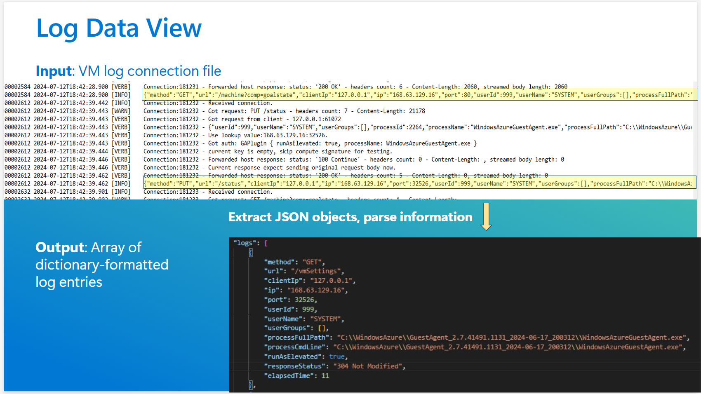

# Converting audit logs to an allowlist

See [Advanced Configuration](../advanced-configuration.md) first to learn about Role Based Access Control (RBAC) and the `InVMAccessControlProfile` resource type in Metadata Security Protocol (MSP).

## Collecting Audit Logs

If MSP is enabled in `Audit` or `Enforce` mode, the GPA creates audit logs in the Virtual Machine (VM).

| OS Family | Audit Log Location |
|--|--|
| Linux | `/var/lib/azure-proxy-agent/ProxyAgent.Connection.log` |
| Windows | `C:\WindowsAzure\ProxyAgent\Logs\ProxyAgent.Connection.log` |

## Converting Logs to Rules

There are two ways to create an Allowlist:
- Automated Allowlist generation
- Manually create Allowlist

### Automated Allowlist generation

1. Download and run the Allowlist Tool from either option:
   - Select `allowListTool.exe` from the [latest release page](https://github.com/Azure/GuestProxyAgent/releases/latest)
   - Direct download [link](https://github.com/Azure/GuestProxyAgent/releases/latest/download/allowListTool.exe)
1. Follow the steps in the Allowlist Tool to create your Allowlist and download the generated Allowlist.

### Manually create Allowlist

Once a VM is enabled with MSP in Audit/Enforce mode, the proxy agent would capture all the requests being made to the Host endpoints. The logs are captured in the folder inside the VM:

| Operating System | Log File Path |
|--|--|
| Windows | `C:\WindowsAzure\ProxyAgent\Logs\ProxyAgent.Connection.log` |
| Linux | `/var/lib/azure-proxy-agent/ProxyAgent.Connection.log` |

From the connection logs, you can analyze the applications that are making the requests to the Instance Metadata Service(IMDS)/WireServer endpoints:

[](../images/create-shared-image-gallery/status-log.png#lightbox)

The JSON captured here would be of the format:

[](../images/create-shared-image-gallery/parse-json-from-logs.png#lightbox)

From the log file, you can identify the endpoints that you want to secure (which would be the `privileges` in the final `InVMAccessControlProfile`), and the `identities` that should have access.

A simple rules schema would look like:

[](../images/create-shared-image-gallery/example-access-control-rules.png#lightbox)

> [!NOTE]
> We built an allowlist generator tool to make it easier to generate the Access Control rules. The allowlist tool helps parse the audit logs & provide a UI to generate the Access control roles.

## Creating a New `InVMAccessControlProfile`

### Using ARM template

1. [Create a new private gallery](https://learn.microsoft.com/azure/virtual-machines/create-gallery) in Azure compute gallery.
1. Create an `InVMAccessControlProfile` definition with parameters for:
    - The gallery name to store in (from step 1)
    - Profile name
    - OS type
    - Host Endpoint type (Wireserver or IMDS)
1. Create a specific version

## Sample InVMAccessControlProfile

```
"properties": {
    "mode": "Enforce",
    "defaultAccess": "Allow",
    "rules": {
      "privileges": [
        {
          "name": "GoalState",
          "path": "/machine",
          "queryParameters": {
            "comp": "goalstate"
          }
        }
      ],
      "roles": [
        {
          "name": "Provisioning",
          "privileges": [
            "GoalState"
          ]
        },
        {
          "name": "ManageGuestExtensions",
          "privileges": [
            "GoalState"
          ]
        },
        {
          "name": "MonitoringAndSecret",
          "privileges": [
            "GoalState"
          ]
        }
      ],
      "identities": [
        {
          "name": "WinPA",
          "userName": "SYSTEM",
          "exePath": "C:\\Windows\\System32\\cscript.exe"
        },
        {
          "name": "GuestAgent",
          "userName": "SYSTEM",
          "processName": "WindowsAzureGuestAgent.exe"
        },
        {
          "name": "WaAppAgent",
          "userName": "SYSTEM",
          "processName": "WaAppAgent.exe"
        },
        {
          "name": "CollectGuestLogs",
          "userName": "SYSTEM",
          "processName": "CollectGuestLogs.exe"
        },
        {
          "name": "AzureProfileExtension",
          "userName": "SYSTEM",
          "processName": "AzureProfileExtension.exe"
        },
        {
          "name": "AzurePerfCollectorExtension",
          "userName": "SYSTEM",
          "processName": "AzurePerfCollectorExtension.exe"
        },
        {
          "name": "WaSecAgentProv",
          "userName": "SYSTEM",
          "processName": "WaSecAgentProv.exe"
        }
      ],
      "roleAssignments": [
        {
          "role": "Provisioning",
          "identities": [
            "WinPA"
          ]
        },
        {
          "role": "ManageGuestExtensions",
          "identities": [
            "GuestAgent",
            "WaAppAgent",
            "CollectGuestLogs"
          ]
        },
        {
          "role": "MonitoringAndSecret",
          "identities": [
            "AzureProfileExtension",
            "AzurePerfCollectorExtension",
            "WaSecAgentProv"
          ]
        }
      ]
    },
```
