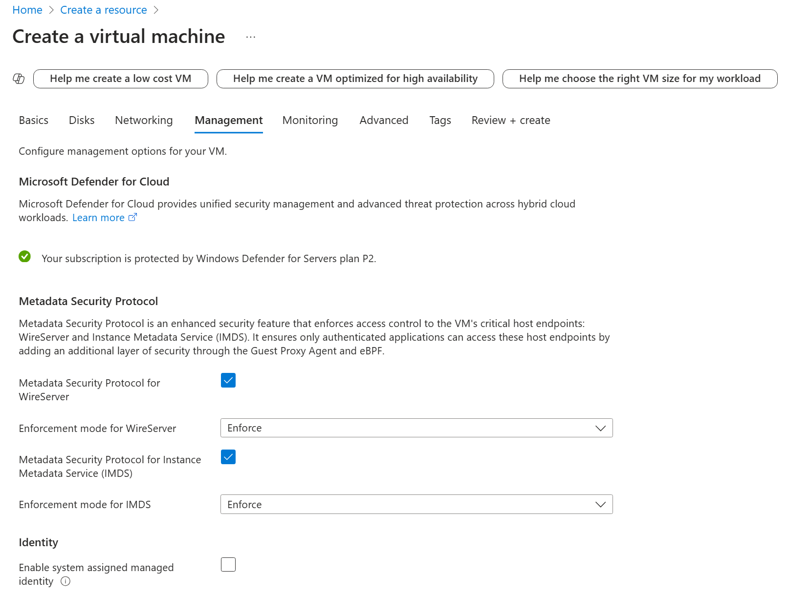
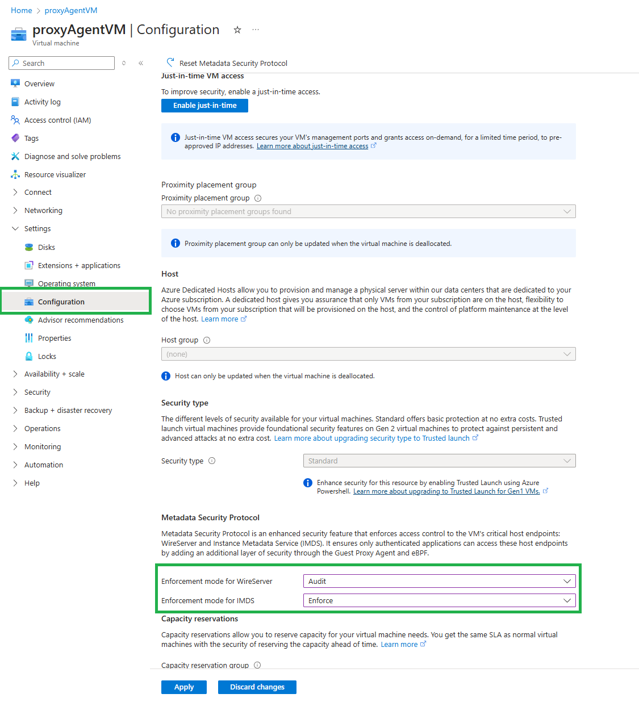

# MSP via portal

Azure portal has preview support for configuring some aspects of Metadata Security Protocol (MSP) using [this link](https://ms.portal.azure.com/?feature.canmodifystamps=true&Microsoft_Azure_Compute=flight34).

> [!NOTE]
> Currently, the portal view would only be available for subscriptions registered with "Microsoft.Compute/ProxyAgentPreview" Azure Feature Exposure Control (AFEC) flag.

## Deploy a VM with MSP

> [!Note]
> Portal currently only supports [inline / basic](../configuration.md#inline-configuration) configuration.

## Enable MSP on an existing VM

